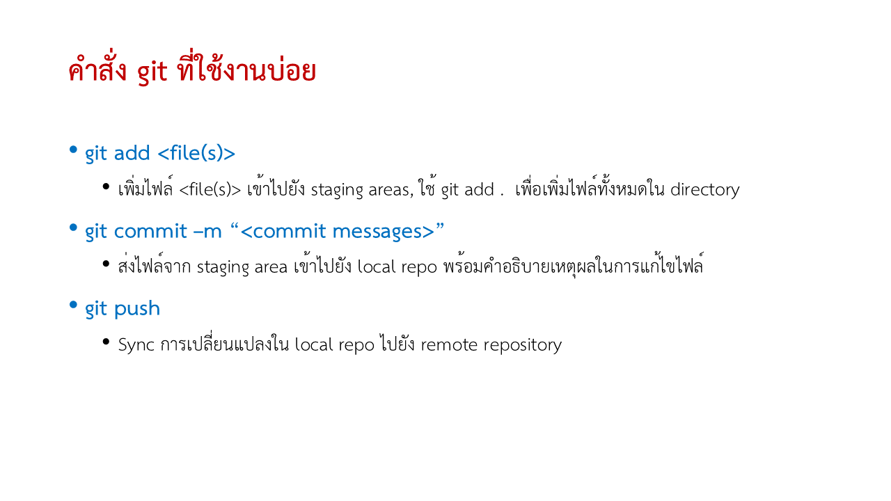
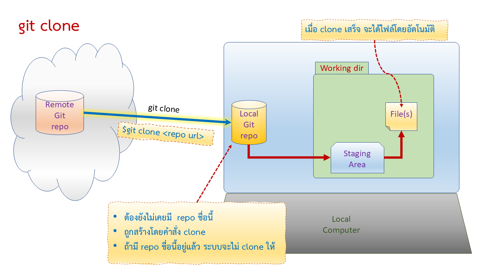
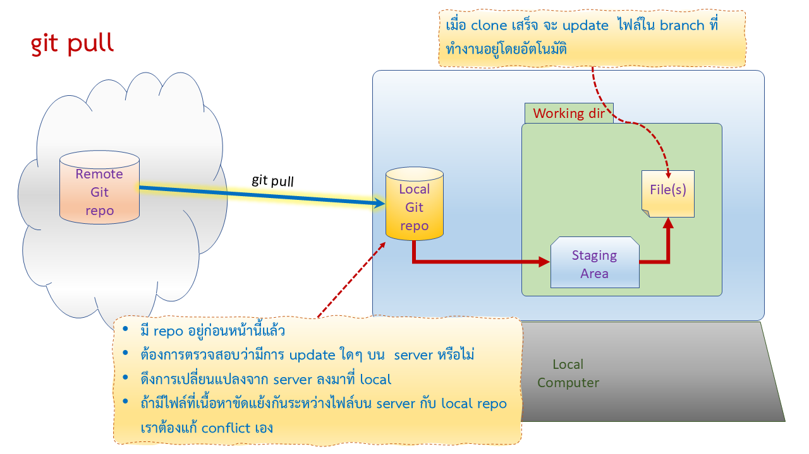
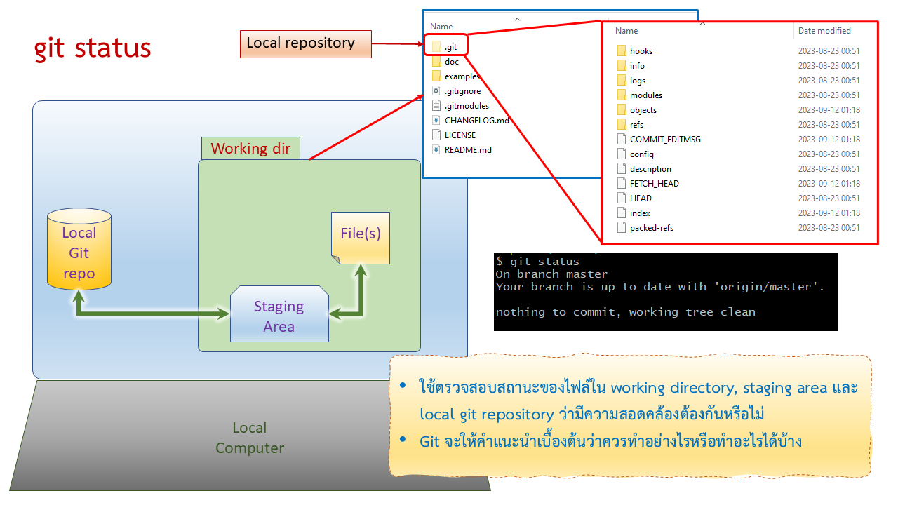
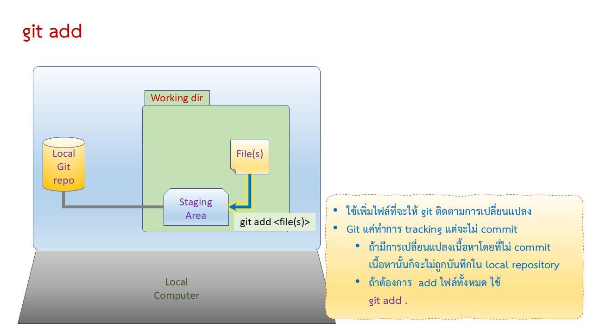
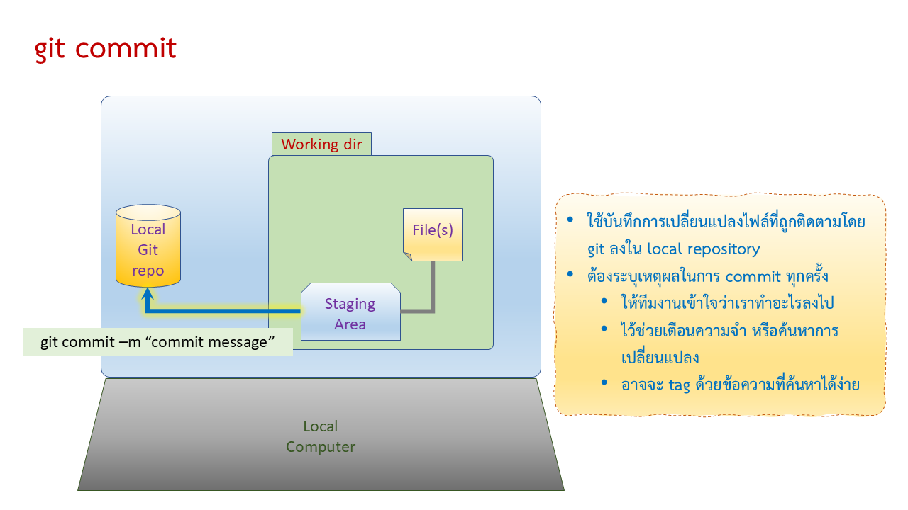
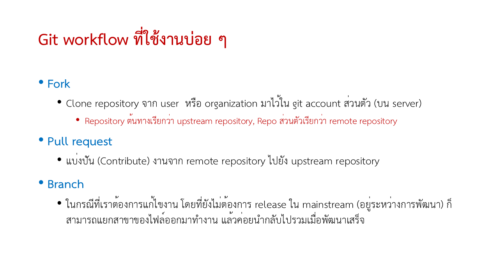
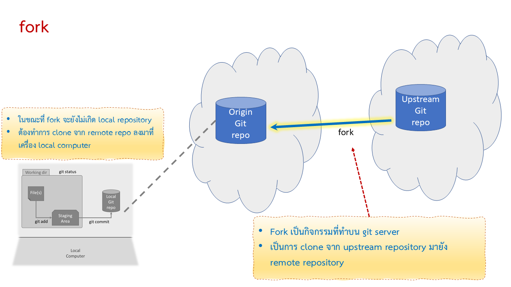
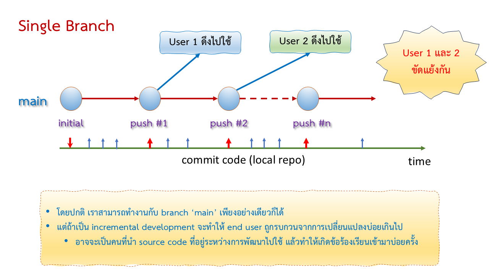
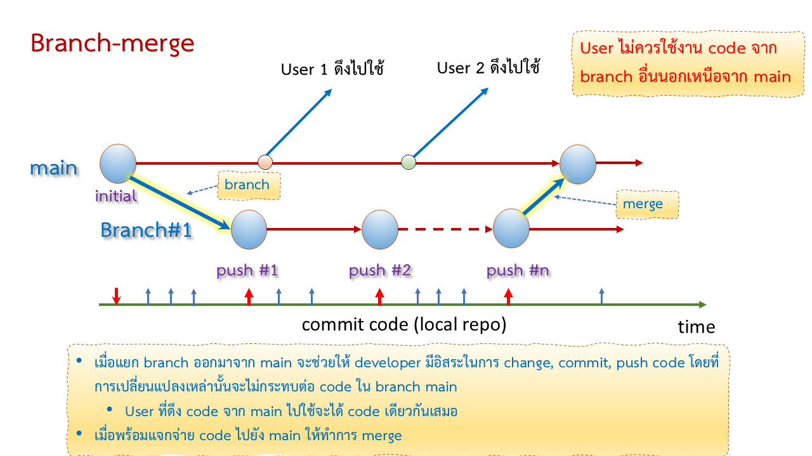

# คำสั่ง Git ที่ใช้งานบ่อย

## คำสั่งพื้นฐาน

### git clone 

คำสั่ง git clone เป็นคำสั่งพื้นฐานและสำคัญมากใน Git ใช้สำหรับดึง repository บนเซิร์ฟเวอร์ (เช่น GitHub, GitLab หรือ Bitbucket)มาสร้างสำเนาในเครื่องคอมพิวเตอร์ของเรา (local computer) เพื่อให้สามารถแก้ไข พัฒนา หรือทำงานร่วมกับโค้ดของ repository นั้นได้โดยตรง

คำสั่ง clone ช่วยให้เราสามารถสร้างสำเนาของ code ไว้ได้อย่างน้อย 2 ที่ (local และ remote) รวมทั้งสามารถทำงานเป็นทีมได้อย่างง่ายดาย

### git pull
คำสั่ง git pull ใช้เพื่อดึงเนื้อหาล่าสุดของ branch ปัจจุบัน จาก remote (origin) repository ซึ่งอาจจะถูกแก้ไขโดยเราเองบนคอมพิวเตอร์เครื่องอื่น หรือถูกแก้โดยผู้ใช้รายอื่น

ในการทำงานเป็นทีมนั้น git pull จะช่วยป้องกันการทำงานซ้ำซ้อน เนื่องจากก่อนที่จะลงมือทำสิ่งใด เราต้อง pull เพื่อดูเนื้อหาล่าสุดบน remote repository ที่เพื่อนร่วมทีมแก้ไขไปแล้ว 

git pull ช่วยให้เราดึง features ใหม่ ๆ จาก remote repository มาใช้งานได้ทันที

คำสั่ง git pull จะซ่อนการทำงานของอีก 2 คำสั่งไว้ภายใน ได้แก่คำสั่ง  git fetch และ git merge 

สิ่งที่ควรระวังเมื่อใช้คำสั่ง git pull คือการแย้ง (conflic) ของเนื้อหาที่ถูกแก้ไขบน local และ remote ถ้ามีการแก้ไขในบรรทัดเดียวกันทั้งสองแห่ง จะไม่สามารถ merge โดยอัตโนมัติ เราต้องตรวจสอบโดยละเอียดก่อนทำการ merge ด้วยตนเอง 

### git status

คำสั่ง git status ใช้เพื่อตรวจสอบสถานะของไฟล์ใน git (working directory, staging area, local repo)

ก่อนที่จะทำการ commit หรือ push การเปลี่ยนแปลง ควรใช้คำสั่ง git status เพื่อตรวจสอบว่ามีการเปลี่ยนแปลงใด ๆ เกิดขึ้นกับงานของเราหรือไม่ และการเปลี่ยนแปลงเหล่านั้นถูกต้องตามที่ต้องการหรือไม่ คำสั่ง git status ไม่ส่งผลต่อเนื้อหาใด ๆ ใน repository

ถ้าคิดไม่ออกว่าจะทำอะไรกับ repo ให้ใช้คำสั่ง git status เพื่อดูว่าเราสามารถทำอะไรได้บ้าง ซึ่ง  git status จะแสดง งานที่สามารถทำได้ด้วยข้อความง่าย ๆ  และการใช้ git status เป็นประจำจะช่วยลดความเสี่ยงในการเกิดข้อผิดพลาดในการทำงานกับ Git

### git add

คำสั่ง git add เป็นคำสั่งที่ใช้เลือกไฟล์ เพื่อที่จะเก็บเข้าไว้ใน local repository  

ในการ commit ไฟล์เข้าสู้ repository สามารถ commit ทั้งหมดในครั้งเดียว หรือแบ่งเป็นรอบ ๆ ตามการทำงานหรือชนิดของไฟล์  เช่น commit นี้สำหรับส่งไฟล์ graphics ทั้งหมดเข้าไปเก็บ เนื่องจากเป็นไฟล์ที่ไม่ต้องเปลี่ยนแปลงบ่อย ในขณะที่บาง commit อาจจะเก็บไฟล์ที่เปลี่ยนแปลงบ่อยๆ หรือเก็บไฟล์ที่ต้อง update ประจำวัน เป็นต้น

### git commit

คำสั่ง git commit เป็นการ save การเปลี่ยนแปลงทั้งหมดที่ได้ทำไว้ด้วยคำสั่ง git add เข้าไปยัง repository ไม่ว่าจะทำการ add กี่ครั้งก็ตาม เมื่อใช้คำสั่ง commit จะถูกเก็บเป็น commit เดียวเท่านั้น

คำสั่ง git commit ช่วยให้เราสามารถย้อนอดีตไปยังจุดที่ต้องการได้ เช่นเมื่อ commit ล่าสุดไม่ตรงตามความต้องการของ user เราก็สามารถดึง commit ก่อนหน้ากลับมาใช้งานไปพลางก่อน แล้วดำเนินการแก้ไขเงาน โดยไม่กระทบกับความต้องการของผู้ใช้

### git push

คำสั่ง git push นั้นเปรียบเสมือนการ "อัปโหลด" การเปลี่ยนแปลงที่คุณได้ commit ไว้ใน local repository ของคุณไปยัง remote repository (เช่น GitHub, GitLab) ที่อยู่บนเซิร์ฟเวอร์ คิดง่ายๆ ก็คือ การแบ่งปันการเปลี่ยนแปลงที่คุณทำกับคนอื่นๆ ในทีม หรือการสร้าง backup ของโค้ดของคุณไว้บน cloud นั่นเอง

##  Git workflow ที่ใช้งานบ่อย

---